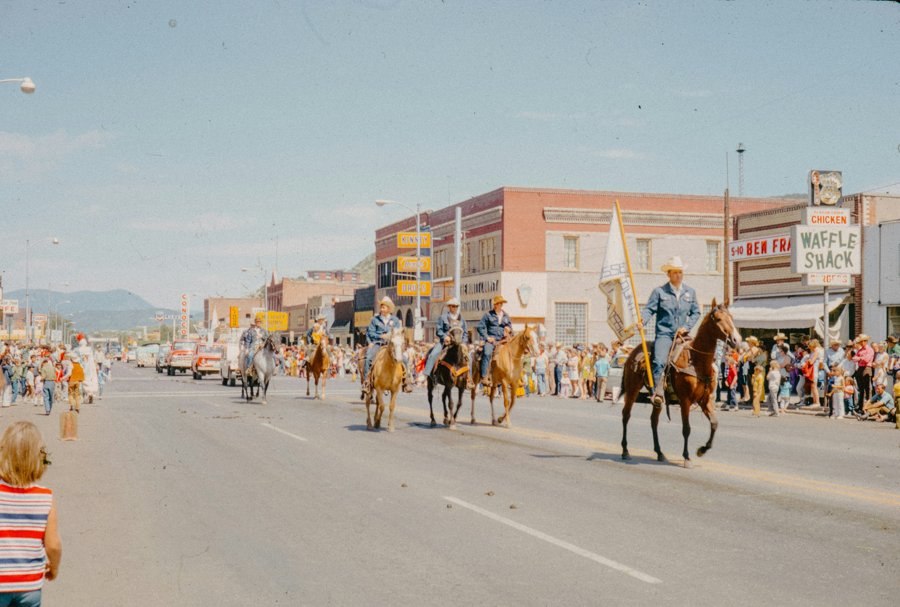
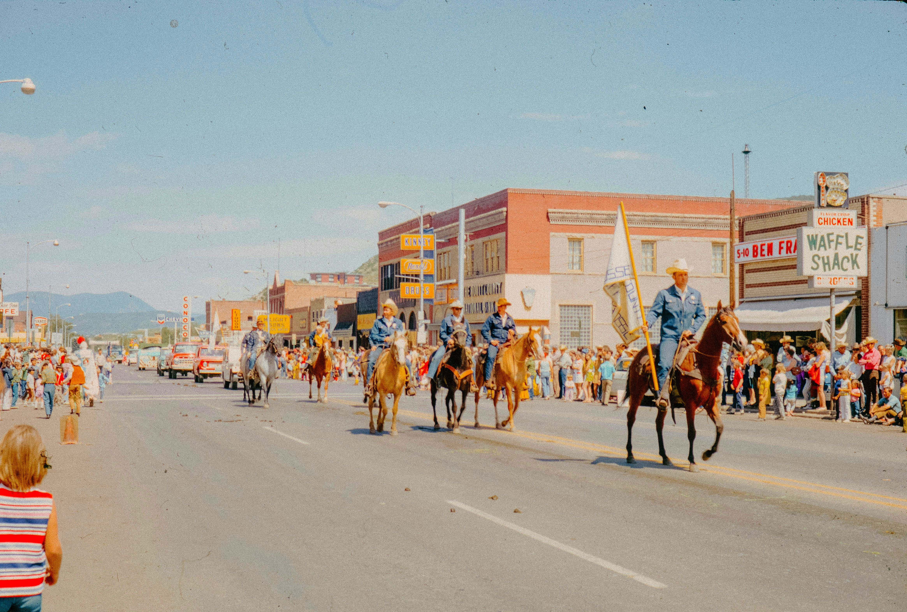

<p align="center">
  <a href="README.md">EN</a>
  ·
  <a href="README.tr.md">TR</a>
  ·
  <a href="README.de.md">DE</a>
  ·
  <a href="README.es.md">ES</a>
</p>

# Massen-Fotofilterung

Aktualisieren Sie mehrere Bilder mit demselben Preset. Wenden Sie dieselben Einstellungen auf alle an.

## Beispiele

| Vorher | Nachher |
|--------|---------|
|  |  |
|  |  |

## Installation

Sie benötigen den bun-Paketmanager von [bun.sh](https://bun.sh).

```bash
# windows
powershell -c "irm bun.sh/install.ps1|iex"

# macos / linux
curl -fsSL https://bun.sh/install | bash
```

### Nach der Installation

```bash
# Öffnen Sie ein neues Terminalfenster
# Überprüfen Sie, ob bun installiert ist
bun -v
```

## Wie benutzt man das?

1. Öffnen Sie ein Terminal im Projektordner
2. Führen Sie den Befehl `bun i` aus
3. Verschieben Sie Ihre Bilder in den Ordner `import/`
4. Aktualisieren Sie die Datei `preset.json` nach Ihren Bedürfnissen
5. Führen Sie den Befehl `bun start` aus
6. Warten Sie auf die Ergebnisse
7. Überprüfen Sie den Ordner `export/`

## Skripte

### Start

```bash
bun start
```

Bearbeitet die Bilder aus dem Ordner `import/`. Wendet die Filter aus der Datei `preset.json` an. Exportiert in den Ordner `export/`.

### Clean

```bash
bun run clean
```

Entfernt die Dateien in den Ordnern `import/` und `export/`.
